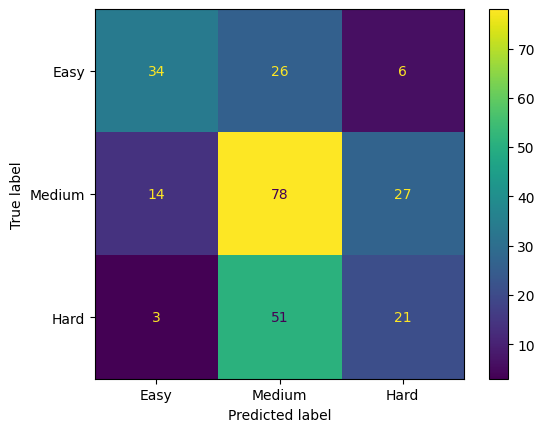

# Classificação de Dificuldade em Problemas de Programação
Um modelo de rede neural para classificar a dificuldade de problemas de programação.

## Descrição

Nesse projeto foi implementado um modelo de classificação automática da dificuldade em problemas de programação para facilitar a seleção de exercícios por estudantes em juízes online (JOs). Reconhece-se que a tarefa de classificação manual demanda tempo e especialistas, motivando o desenvolvimento de um sistema automático baseado em técnicas de aprendizado profundo.

## Predição

Para testar o modelo com seus dados, acesso o [Colab](inferencia.ipynb).

## Treinamento

Para treinar o modelo, siga os seguintes passos:

1. Faça o download do repositório
2. Acesso o diretório `workspace`
3. Execute o seguinte comando `python3 train.py`
